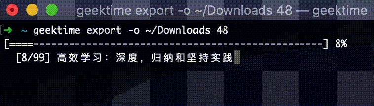

# geektime-cli

<div align="center">
  
</div>

> CLI for <https://time.geekbang.org> (极客时间)

## INSTALL
```bash
npm install geektime-cli -g
# or
yarn global add geektime-cli
```

## USAGE
```
  Usage: geektime [options] [command]

  Options:

    -V, --version             output the version number
    -h, --help                output usage information

  Commands:

    login <phone> <password>  登录极客时间
    products                  获取已购列表
    articles <cid>            获取文章列表
    article <id>              获取文章内容
    export [options] <cid>    导出专栏文章
    mp3 [options] <cid>       导出专栏音频
```

## License

MIT
